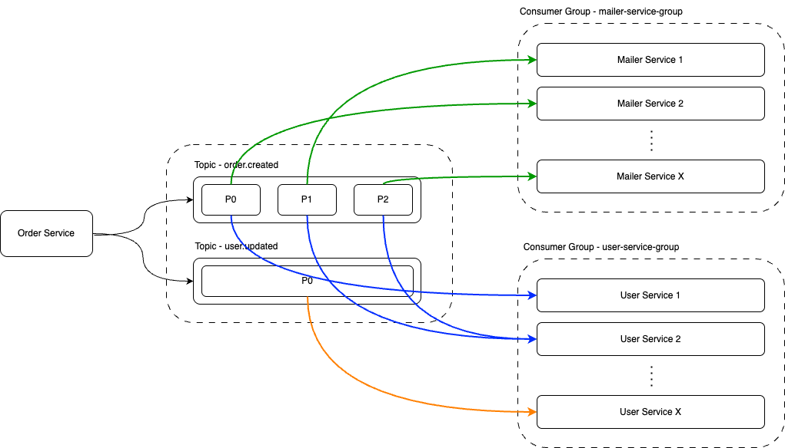

# Kafka Practical Demo (ZooKeeper)



Welcome to this Kafka practical demo project!  
This project is inspired by the amazing content from **SWE with Vivek Bharatha** — particularly his YouTube series:  
**_Kafka fundamentals every developer must know - Part 2_**.  
(Watch the full series [here](https://www.youtube.com/@swe-with-vivekbharatha))

> 🚀 This project focuses on demonstrating **Kafka fundamentals** in a hands-on, end-to-end setup with local Docker infrastructure and multiple microservices simulating real-world event-driven communication.

---

## 📚 Concepts Covered

- Apache Kafka Basics: Topics, Partitions, Producers, Consumers
- Kafka Setup using Docker Compose
- Kafka UI Overview
- Producer Service: Publishing messages into topics
- Consumer Services: Consuming messages from topics
- Multiple Consumers & Consumer Groups
- Partition Rebalancing (with live rebalancing examples)
- Consumer Failover Handling
- Benchmark Load Testing with `autocannon`

---

## 🛠 Project Structure

| Folder/File            | Description                                                  |
| ---------------------- | ------------------------------------------------------------ |
| `docker-compose.yaml`   | Sets up Zookeeper, Kafka Broker, and Kafka UI locally         |
| `src/init.ts`           | Bootstrap script to create topics and partitions             |
| `src/order-service/`    | Kafka producer/consumer for handling order events             |
| `src/mailer-service/`   | Kafka consumer for handling "order-created" email notifications |
| `src/user-service/`     | Kafka consumer for handling "user-updated" and "order-created" events |
| `src/types/`            | Shared TypeScript types and interfaces                       |
| `src/ac.ts`             | Benchmarking script using autocannon to simulate load         |
| `assets/`               | Architecture diagrams and flow charts                        |
| `tsconfig.json`         | TypeScript configuration                                      |

---

## 🐳 Local Kafka Setup (via Docker)

This project uses **Docker Compose** to spin up the following services:

- **Zookeeper** (manages metadata for Kafka)
- **Kafka Broker** (handles messages and topics)
- **Kafka UI** (simple web interface to monitor topics and consumers)

```bash
# From project root
docker-compose up -d
```

Services available:
- Zookeeper → `localhost:2181`
- Kafka Broker → `localhost:9094`
- Kafka UI → `http://localhost:8080`

---

## ⚡ How to Run

### 1. Bootstrap Kafka Topics

Create necessary Kafka topics (with partitions):

```bash
npm run init
```

Topics created:
- `order.created` → 3 partitions
- `user.updated` → 1 partition

---

### 2. Start Services

Each service has its own purpose:

| Service | Role | How to Start |
| :------ | :-- | :----------- |
| Order Service | Producer | `npm run order-service` |
| Mailer Service | Consumer Group (Mailer) | `npm run mailer-service` |
| User Service | Consumer Group (User) | `npm run user-service` |

---

### 3. Load Test (Optional)

You can simulate thousands of random orders using `autocannon`:

```bash
npm run ac
```

This sends rapid HTTP requests to the **Order Service**, pushing thousands of events into Kafka.

---

## 🧠 Key Learnings from the Project

- How Kafka manages **messages across partitions**.
- How **Consumer Groups** split load among multiple consumers.
- How **rebalancing** happens automatically when new consumers join or leave.
- How **producer keys** ensure ordering within a partition.
- How to **gracefully shutdown** Kafka consumers and producers.
- How **load testing** affects topic partitions and consumer throughput.

---

## 📷 Kafka Architecture Overview

The following diagram shows how Order Service produces messages and multiple consumer groups (Mailer Services, User Services) consume them independently:


---

## 📖 Reference and Acknowledgements

This project is inspired by:

> 🎥 [**Kafka fundamentals every developer must know - Part 2**](https://www.youtube.com/watch?v=YOUR_VIDEO_LINK)  
> by **SWE with Vivek Bharatha**  
> - YouTube: [@swe-with-vivekbharatha](https://www.youtube.com/@swe-with-vivekbharatha)
> - LinkedIn: [Vivek Bharatha](https://linkedin.com/in/vivek-bharatha)
> - GitHub: [vivekbharatha](https://github.com/vivekbharatha)
> - Medium: [vivek.bharatha](https://medium.com/@vivek.bharatha)
